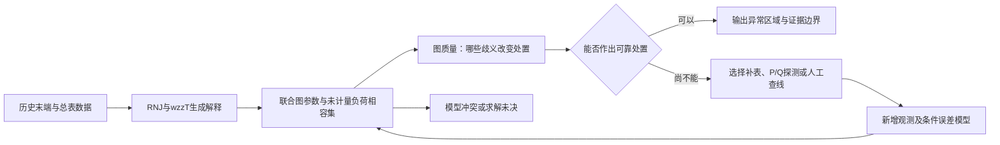

# 窃电、线路图质量与最优寻线：统一研究主线及可执行路线

调研日期：2026-09-27。基于当日工作区源码、已有实验文件和可访问的原始文献。研究期间保留工作区已有修改，仅在本目录新增产物。

**建议主线：在拓扑与参数不确定的配电网中，给出未计量负荷的可信区域，并用最小代价的补测消除会改变处置结论的歧义。**

这条主线能自然地容纳三个问题：窃电提供实际任务；图质量回答当前网络模型是否足以支撑该任务；最优寻线决定还需要知道什么、去哪里测。真正值得追求的贡献，是明确“什么时候能够判断，什么时候只能保留多个解释，以及哪一种测量能够改变这个结论”。把 RNJ、MILP、置信度和信息熵依次串联，本身不足以构成新论文。

本次完成的是代码与文献调研、数学框架、独立数学反例及统计示例、论文和实验设计。**没有完成新的三相 AC 联合识别方法、序贯置信程序或实际查线试验。** 文中的计划指标与拟议定理均按此区分。

还完成了一个现有量测缓存上的小型错图诊断：三份正常/内部事件/末端事件的基线完整回放一致；修改推断字典后，某个真实末端 108 的事件被排到 109，而 108 仍在候选域中。这为“图错误如何改变窃电定位”提供了可追溯的机制例子，不能作为错误率、覆盖率或新方法优势的估计。

## 阅读入口

| 文件 | 用途 |
|---|---|
| 本文 | 总体判断、统一模型、论文定位、实施优先级与实验协议 |
| [窃电分报告](theft_research.md) | 现有结果审计、相邻文献、隐负荷可辨识性和候选新方向 |
| [线路图质量分报告](graph_quality_research.md) | 物理图语义、置信外集、求解上下界、任务相关质量指标 |
| [最优寻线分报告](active_search_research.md) | 主动探测、人工核查、最优设计、动作约束与停止规则 |
| [数学示例说明](mathematical_pilots.md) | 五组可复核示例、假设、推导、结果与限制 |
| [独立运行脚本](run_mathematical_pilots.py) / [结果 JSON](mathematical_pilot_results.json) | 不依赖生产算法的数理核验；包含种子和源码哈希 |
| [错图机制诊断](wrong_graph_pilot.md) | 三份已有量测的基线回放和两种预设错字典；9 行配对结果 |
| [产物与来源清单](artifact_manifest.json) | 文件 SHA-256、来源快照、链接/编码及复现核验记录 |

## 1. 当前最有价值的资产和真正缺口

### 1.1 现有内容已经走到哪里

截至本次读取，权威核心是 `rnj_wzzt_core/rnj_wzzt`。`laminar_l1_milp.py` 直接优化与当前层状族相容的新二进制支撑；**当前核心已移除 RNJ 白名单参数**。固定初始支撑、单步精确扩展、多步贪心路径和最终验证集选择是不同层次。旧白名单结果和旧接口不能当作当前默认方法的验证。

窃电独立包保留了较早的代码与实验协议，应和当前核心分别冻结。现有成熟证据也远多于早期 noiseless pilot：`docs/theft_paper_readiness_20260919.md` 与 V3 文件记录了 3171 个场景、独立开发/校准/测试、有限零假设库、固定窗口区域定位和求解证书。但这些结果所用三棵辨识约简树的结构评分均为满分，因此**最关键的“辨错的图会怎样影响窃电判断”尚未被该结果检验**。这恰好是三个研究点的连接处。

当前 `models/lin_distflow.py` 已支持观测节点 × 注入节点的矩形 R/X；不能沿用旧结论“injection_terminals 被忽略”。但生产场景校验仍要求隐藏中间节点零注入。这说明隐藏负荷研究已有部分数学工具，尚不能把生产场景限制简单取消就认为完整支持。

已有 `rnj_wzzt_core/docs/prior_acquisition_design.md` 和配套脚本研究了人工查询、候选分歧与成本。已有 9 月 23—25 日文档也讨论了置信集合、Universal Inference 和边影响指标。本次应继续这些内容，不将其重新命名为创新。

| 资产 | 可复用部分 | 下一步的缺口 |
|---|---|---|
| RNJ + 自由支撑 wzzᵀ 扩展 | 生成结构、参数拟合、原始/对偶诊断 | 单步优化证书不是完整图/原假设证书；错误冻结需回退 |
| 已有窃电区域识别与 V3 校准 | 绝对量通道、总表锚点、固定位置枚举、失败记录 | 错误拓扑、连续 nuisance 域、移动/多源、合法漏表负荷 |
| 图质量与 D0/D1 设计 | 区分有边证据、无边证据和模型冲突 | 将指标变为可核验的外集或校准程序，仍缺实现 |
| 人工核查排序 | 具名事实、成本、未知结构评分、候选缺失处理 | 同预算闭环收益；有噪答案；跨模态与任务损失 |
| 多源字典诊断 | 调和等价、稀疏唯一性充分条件 | 未知参数/AC 条件下的稳定分辨界及补测设计 |

### 1.2 三个名词应如何落到可检验对象

- **窃电**：物理量测直接支持的是未计量正负荷、异常能量差和区域解释。若合法未登记负荷与窃电有相同电气行为，仅凭电气数据无法区分行为性质。论文可研究 electricity-theft screening，但输出应首先是 unmetered-load evidence。
- **线路图质量**：有真值时评价结构准确度；没有真值时评价模型兼容性、未解决的结构/参数歧义、任务风险和可辨识程度。不能用一个无真值分数冒充 F1 或正确概率。
- **最优寻线**：包括追加被动量测、P/Q 小扰动、便携支路表和人工接线核查。计算机继续搜索拓扑是第四种资源消耗，需要和现场动作分别记账。“最优”必须限定动作集合、时间范围、损失函数及求解保证。

## 2. 推荐的统一模型：保留相容解释，再决定补测

### 2.1 状态、量测和单位

设 O 为 m 个观测末端，T 为具有明确语义的约简树，θ 为阻抗/相别等参数，h 为候选未计量区域，a_t≥0 为其有功。先研究一段窗口内固定 h、已知或有界功率因数 κ 的单源。

以负荷为正，定义平方电压降 y_t=v_{0,t}²1−v_{O,t}²。下式中的 R、X 使用平方电压约定，已经包含因子 2：

\[
y_t=R_{OO}(T,\theta)p_t+X_{OO}(T,\theta)q_t
      +g_h(T,\theta,\kappa)a_t+b_t+\epsilon^v_t,
\quad g_h=R_{Oh}+\kappa X_{Oh}.
\]

其中 R_OO、X_OO 为 m×m，g_h 为 m×1，p_t、q_t、y_t 为 m×1。约简树的原子表达为 R=Σ_e r_e z_ez_eᵀ、X=Σ_e x_e z_ez_eᵀ。物理内部节点 h 的列与下游 clade 的列需要显式映射，不能默认恢复出的匿名节点就是某个现场母线。

总表通道保留符号：

\[
m_t=P^m_{0,t}-\sum_{i\in O}P^m_{i,t}
    =\ell_t(T,\theta,p,q,a)+a_t+u^{legal}_t+b^P_t+\epsilon^P_t.
\]

线损 ℓ、合法未计量负荷 u^legal、表计偏置 b^P 不能同时被默认为零。**真实合法负荷也必须影响电压与损耗**：上式 b_t 包含其按同一位置、功率因数和幅值映射得到的电压贡献，总表的 u^legal 是这些负荷有功之和，ℓ 同时计入它们的潮流；参考电压偏置是 b_t 中另一种独立声明的成分。不能让合法负荷只进入总表方程而人为制造可区分性。第一阶段可以明确固定合法漏表负荷为零，再将它作为域外失配实验。

拟合/检验时保留负残差，非负约束只作用于真实隐藏有功 a。若用同一组子表 P 既估幅值又算电压预测，两通道误差相关，不能把二者当成独立证据相乘。

将一个完整解释记为 ω=(T,θ,h,a,κ,η)，η 汇总线损误差、根公共模态、表计误差与可声明的其他 nuisance。任务标签 g(ω) 是预先定义的状态属性，例如“目标异常注入 a 未达到幅值阈值”或“某区域的 a 达到阈值”。a=0 不等于不存在合法漏表负荷 u^legal；如果两者电气等效，应保留歧义，不能靠重命名变量辨别行为性质。“暂无法区分”是依赖数据的输出 ⊥，不属于世界状态标签；检查哪些设备则属于决策 d。下面的 g(ω)=s 原假设只针对预先定义的状态标签。

### 2.2 先做相容集合，暂不强行给每条边概率

先实现可审计的版本：在规定模型域 Ω 和误差集合 E 内保留所有相容解释。

\[
\mathcal C(D)=\{\omega\in\Omega:D-F(\omega)\in\mathcal E\}.
\]

以下三种保证均以**真实配置 ω* 确实属于声明模型域 Ω**为前提。误差集合的覆盖不能弥补真实拓扑、合法负荷或噪声机制被模型域遗漏。

这里有三种不同的证据等级：

1. E 是确实成立的确定误差界，则给确定性的相容集合结论。
2. E 由满足相应假设的方法取得联合覆盖，则可以把覆盖转移到 C。
3. E 只是仿真分位数或工程容差，则称经验相容集合，并独立评估覆盖率。

对于已有有限图池 P，C∩P 只是内近似。若池内所有图都支持一个窃电位置，仍不能排除池外的正常解释。当前自由支撑搜索改善了生成候选的范围，但它不是全体相容图枚举，也不能自动消除这个问题。

输出可以同时包括：相容位置集合、幅值区间、共同 clade、被排除 clade、模型冲突、未完成求解的分支，以及决定下一步处置的最坏损失。跨图位置集合必须先映射到同一套可观测终端组、可核查设备或物理区域；不同树的匿名隐藏节点编号不能直接取并集。既不需要把优化目标写成概率，也保留以后接入正确似然或独立概率校准的接口。

## 3. 值得深入学习的数学，以及能产生什么结果

### 3.1 部分辨识和观测等价：从“恢复一个图”到“恢复足够用的事实”

若两个状态在每个可达历史和允许动作 u 下都有相同的**条件观测核**，那么任何使用共同策略、只根据过去选动作的自适应过程都无法稳定区分它们。独立重复观测模型下，可以简化为每个动作的分布相同；时间相关模型中只比较逐次边际分布则不够。对等先验二分类，完整记录同分布时最小错误率为 1/2；不是求解器或样本数不足。

证明直觉：第一轮数据同分布，策略看到的历史同分布，因此第二轮动作同分布；逐轮归纳，完整记录仍同分布。这个命题也说明一个有价值的负结果：**新增什么传感器或动作，才能打破现有等价类？**

已有多源研究发现离散调和导致的单源/多源等价，可作为这条理论线的基础。首篇宜限制单源和最小可检幅值 a_min>0。若允许 a→0，存在与不存在的观测分布可任意接近，不能承诺对任意弱事件都可靠检出；若允许线路权重→0，边的存在同样需要分辨尺度。

潜在成果应是“给定测量与动作集合的分辨区域”，例如：不增内部表时只能判断某子树有异常；增某一支路表后可以区分两个区域。树度数、观测位置、源幅值和参数区间都要进入结论。

### 3.2 干扰参数投影和 Schur 补：什么信息会被重新拟合吸收

固定局部线性模型，设 δ 是两种解释的均值差，Bγ 为能够由参数重估/公共偏置吸收的差异，W=Σ⁻¹ 是已声明协方差的精度矩阵，W¹ᐟ² 用于白化。先解

\[
d^2=\min_\gamma\|W^{1/2}(\delta-B\gamma)\|_2^2
=\|(I-\widetilde B\widetilde B^+)W^{1/2}\delta\|_2^2,
\quad \widetilde B=W^{1/2}B.
\]

若该值为零，两种解释在这个线性 nuisance 模型下可以互相拟合。相应有效信息矩阵为

\[
I_{h\mid\eta}=J_h^\top WJ_h-
J_h^\top WJ_\eta(J_\eta^\top WJ_\eta)^+J_\eta^\top WJ_h.
\]

这提供了比“残差大、响应大、Fisher 信息总量大”更贴近任务的图质量指标。h 离散时不要直接对编号求导；J_h 应解释为所关心的连续源参数，或用离散假设均值差替代。

限制也很明确：切空间/Schur 补通常是局部工具；有界参数、非线性 AC、多模型不同切空间，需要直接做约束 profile optimization，不能把局部投影当全局不可辨识证明。本次独立示例中，大小为 200 的平方响应差被公共模态全部吸收，大小为 2 的差异反而全部保留。

### 3.3 集合外包与求解证书：算不完时怎样仍然诚实

若有可信的统计模型，可将 Universal Inference 接到完整的原假设求解器。训练集构造正规化预测密度 q，独立验证数据 Y 上，对离散标签 s 的复合原假设定义

\[
E_s=\frac{q(Y)}{\sup_{\omega:g(\omega)=s}p_\omega(Y)}.
\]

在 s 为真且训练/验证分离等条件下，E[E_s]≤1；保留 E_s<1/α 形成标签集合。这来自已有 [Universal Inference](https://arxiv.org/abs/1912.11436)，不是本项目的新定理。

若图、clade、区域和幅值结论共享同一个 q、验证数据、联合似然及 Ω，它们可统一视为联合集合 K={ω:q(Y)/p_ω(Y)<1/α} 的投影。所有真实属性的复合统计量都不大于 q(Y)/p_{ω*}(Y)，因此可以在同一个覆盖事件上同时陈述这些属性；不是每多画一条边都要另加一次 Bonferroni。若每条边分别挑选 q、数据窗或阈值，则不能继承这一共同保证。连续参数域上使用严格小于也避免把未达到上确界的边界点误写成存在可行见证。

令 J_q=−log q(Y)，m_s=inf_{g(ω)=s}[−log p_ω(Y)]，求解器给 L_s≤m_s≤U_s，则

\[
e^{L_s-J_q}\le E_s\le e^{U_s-J_q}.
\]

**只在下界已经超过检验阈值时排除该解释。** 可行解给的 U_s 不能用于此排除。未求完时扩大集合；“保留”也不等于“接受为真”。当前单步 MILP 的 dual_bound 只覆盖其自身模型，必须构建正确的“无窃电”“该 clade 不存在”等完整 null-oracle 才能使用。

固定数据和 q 时，增加计算预算可以不断提高有效下界。任意时刻输出的外集始终包含同一个理想集合，因此可以根据计算进度停止。新增量测、重新选择 q 或反复移动测试窗口，则是另一种序贯统计问题，需要 e-process 或预先分配错误预算。

最困难的不是指数公式，而是可信噪声模型、EIV、全域有效下界与模型域覆盖。建议先做线性/固定协方差的可证明子问题，再将 AC 作为失配压力实验；不要直接把当前 MAE 写成 exp(−MAE) 并声称有效似然。

### 3.4 最优设计：区分模型，比精确拟合同一模型更重要

已有 [Robust T-optimal discriminating designs](https://arxiv.org/abs/1309.4652) 专门研究模型区分与参数失配。对 Topo，可将动作设计 ξ 写为一批探测位置、幅值、时长和传感器配置，比较会导致不同处置的两类解释：

\[
\Delta_{ss'}(\xi)=
\inf_{\omega\in\mathcal C_s,\ \omega'\in\mathcal C_{s'}}
\sum_j w_j\|\mu_\omega(u_j)-\mu_{\omega'}(u_j)\|^2_{\Sigma_j^{-1}}.
\]

这里 w_j=n_j 表示动作 j 的独立重复次数；相同已知协方差的高斯模型下，固定两状态时该总平方距离的一半等于整个探测批次的 KL。若 w_j 归一化为动作比例，该量改为每次观测的平均 KL，总次数 N 需另乘。存在相关噪声时应堆叠整个批次并使用完整联合协方差。复合假设的下确界表示最难区分的情形，不是任意分布的通用 KL。

**参数必须跨整个探测批次保持一致。** 如果每个动作都允许各自选择一组完全不同的 nuisance，再把单次最小差异加起来，可能过度悲观；如果完全固定一棵拟合树的参数，又可能过度乐观。联合设计正是要处理参数解释在多个动作之间是否能一致。

可采用 max-min 区分/成本，或在明确先验和观测模型下最小化期望处置损失。动作域须同时限制可访问设备、逆变器容量、允许持续时间和电压/电流范围；若采用稳健安全设计，限制对联合相容集和声明扰动集里的全部状态成立，不能只在拟合最佳的一棵树上检查。经典 [Controlled Sensing](https://arxiv.org/abs/1205.0858) 和 [复合假设扩展](https://arxiv.org/abs/1910.12697) 是数学参照；其渐近最优性不能直接转移到未知树、连续阻抗、有噪人工答案的混合问题。

### 3.5 任务损失、信息价值与停止：不必等整张图都恢复

令 d 为停止采集之后的处置，例如安排某区域检查或暂缓告警；继续采集由动作 u 表示，避免把继续测量递归地混入一步终端损失。L(d,ω) 为误报、漏检、出勤与未计量能量的成本。没有可靠后验时可用

\[
\rho(\mathcal C)=\min_d\sup_{\omega\in\mathcal C}L(d,\omega),
\quad
V(u)=\rho(\mathcal C)-\sup_{y\text{ compatible}}\rho(\mathcal C_{u,y})-c(u).
\]

这是一步稳健收益，不自动等于最优多步策略。若有明确的概率模型，可用条件期望版本 EVSI；只有启发式候选权重时须称经验决策评分。

以下停止规则比“熵低于某值”更贴切：所有相容状态都支持同一可接受处置；最坏损失低于指定阈值；或者现有动作无法区分剩余的相关等价类，转入明确的人工核查/无法判断状态。有限池的共同处置只在池内成立。

“用下游损失代替熵”已有直接先行工作：[Loss-Driven Bayesian Active Learning, AISTATS 2026](https://proceedings.mlr.press/v300/huang26b.html)；[GoBOED, 2026-05-25 预印本](https://arxiv.org/abs/2605.26093) 也把实验设计与鲁棒决策连接。本项目的差异应落在电网可辨识边界、隐藏负荷与拓扑混淆、有效求解界和实际可用动作上。

## 4. 将三个点组合成一条完整闭环

每个环节各有明确职责。RNJ/wzzᵀ 负责提出可解释候选；评判模块尽量独立，允许否定原有冻结块；窃电模块给存在、区域和幅值；寻线模块只为剩余的相关歧义付费。

尤其要区分两种后续动作：

1. **网络辨识动作**：短时 P/Q 注入帮助缩小 R/X、相别或结构不确定性。若隐藏负荷不变，它会从差分中消失，信息主要针对网络。
2. **隐藏负荷分辨动作**：临时支路功率表、内部电压、同步绝对电压/总表和具名接线核查，可能给出区分位置或合法/漏计解释的新方程。

一个动作可以同时帮助两者，但必须由前向模型验证，不能从“主动”二字推出因果定位能力。若使用 ZIP 负荷、电压依赖或非线性损耗作为额外信息，需明确这些模型并测试失配，而非事后解释。

## 5. 论文选择：一条主线，两个后续方向

### 5.1 第一优先：拓扑不确定条件下的未计量负荷可信区域定位

建议题目：**面向拓扑不确定性的配电网未计量负荷区域辨识与主动查证**。

英文工作题目：*Unmetered-Load Localization under Distribution-Topology Uncertainty with Cost-Aware Active Verification*。

核心问题：一张拟合良好的错误图是否会把正常负荷解释成窃电，或把窃电放到错误区域？保留相容图/参数后能否控制这一风险，并以少量补测恢复分辨能力？

正文贡献控制为三项：

1. 给出图—参数—隐藏负荷的观测等价、局部分离与测量需求；至少含一个不可能性结果和一个正面的充分条件。
2. 构造在声明模型域中可审计的联合相容集合，将求解超时、候选不足与统计未决分别返回。
3. 用有实际动作约束的查证策略减少最终误处置或检查成本，在同预算、同信息和独立测试条件下验证。

这最接近已有代码，同时补上 V3 未覆盖的关键假设。第一版可以只有便携支路表和具名人工查询，随后加逆变器 P/Q；不必等所有硬件模式都实现。

已有 Weckx 2012、Pengwah 2023、PSCC 2026 等工作涉及参数辨识或模型驱动窃电定位，因此“首次用电压/首次先辨识图再查窃电/首次混合整数定位”都不适合作为贡献。详见分报告的原文条件核查。

### 5.2 第二优先：计算预算受限的图质量证书

建议题目：*Computationally Honest Confidence Sets for Distribution-Network Structure*。

适合数学与优化倾向更强的论文。贡献必须是一个可扩展的完整 null-oracle、其松弛和外集性质，以及计算预算—未决率—错误率的关系；基本 split likelihood 和 LB/UB 方向已经存在。

风险：真实量测似然和 AC 全局界可能成为长期瓶颈。如果先做到固定 R/X 线性族、可信噪声和小规模全枚举，也应把适用域写清，不提前宣称 AC 全网认证。

### 5.3 第三优先：隐藏网络逆源问题与最小传感器增补

建议题目：*Identifiability and Sensor Augmentation for Hidden Loads on Radial Networks*。

围绕树 Green 矩阵、调和延拓、非负稀疏源和节点/边观测，刻画等价类并求最小补表集合。可向漏水、热网或其他树形逆源问题迁移，但不同物理前向模型需要重建，不能直接照搬窃电模型。

该线理论清楚、较少依赖高质量先验概率，但与本项目旧多源调和研究有重叠，需进一步求稳定性界、最小增补复杂度或带成本近似算法，才足以单独成篇。

### 5.4 暂不优先投入的方向

| 想法 | 暂缓原因 | 重新考虑的条件 |
|---|---|---|
| 给每条边分数套 sigmoid | 创新弱且易产生伪概率 | 有独立跨馈线带标签校准总体，且业务确需概率 |
| 直接用大 GNN/生成模型替代当前结构方法 | 数据、比较和解释负担大，未直击现有缺口 | 有大量可信拓扑与事件真值，并证明测量预算优势 |
| 一步联合所有图、连续幅值、多源、三相和未知功率因数 | 当前已有大模型超时证据；双线性破坏原 MILP 精确性 | 分块模型、有效界和小例 oracle 已稳定 |
| 最大熵寻线作为主要创新 | 旧项目和最新主动学习已有类似思想 | 加入明确电网可辨识性和成本保证 |
| 有效电阻杠杆分数作为树边置信度 | 树边 w_eR_eff(e)=1，无法区分树内边 | 改成任务/激励相关影响或对增广网做有意义分析 |
| 只增加同一生成器的种子数 | 不能替代错误拓扑、模型失配、实测/文献基线 | 已补齐这些维度后，用于收窄性能区间 |

## 6. 可执行实验协议：先寻找会推翻方案的例子

### 6.1 预注册比较问题

主指标是**规定误报约束下的区域覆盖与宽度、总查证成本和错误处置损失**。检测 AUC、图 F1、MAE、运行时间为解释性指标；不得用 F1 上升替代窃电任务收益。

第一组是机制实验：图正确/图错误 × 无隐藏负荷/有隐藏负荷的 2×2 组合。图错误必须来自独立训练或事先规定扰动，不能依据测试事件挑出特别有利的错误图。

第二组是信息实验：相同采样点数下，正常被动曲线、公共模态注入、独立 Q/P 注入、一个临时支路表。将幅值、耗时、噪声和可访问设备配平。允许不可区分例子保留为集合，不强迫输出一个位置。

第三组是方法实验：

| 方法 | 目的 |
|---|---|
| 带线损的总表基线 | 判断复杂模型是否只是在重复幅值告警 |
| 已有 V3 固定辨识树 | 量化拓扑不确定性的实际影响 |
| 单张最优树 + 参数重估 | 排除收益只是拟合更灵活 |
| 联合相容图/参数/区域 | 衡量保留歧义的收益和集合变宽代价 |
| 同预算随机、最大分歧、熵、固定网络 D-opt | 对照拟议寻线策略 |
| nuisance-profiled max-min / 任务损失策略 | 检验新增方法是否带来独立收益 |
| 小规模全枚举、已知真图 oracle | 确认数学/求解正确性，给上限而非可部署比较 |

### 6.2 必须覆盖的压力维度

至少覆盖：错误末端冻结、遗漏真 clade、不同 R/X 配比、q≈κp、低激励、根公共误差、P/Q EIV、时间相关、线损偏置、合法未登记负荷、功率因数偏离、弱源、持续源、短源、移动源以及三相不平衡。多源可放扩展，不能悄悄混入单源性能表。

计算层另列：限时可行解、无可行解、下界不足、数值病态、模型 infeasible、候选未覆盖。输出 unknown 是一个需要计数的结果。任何方法超时都保留，不只对成功样本比较精度。

### 6.3 数据拆分与统计评估

开发、模型/策略调参、校准与最终测试按完整序列/馈线/独立条件划分。一个窗口里的时间点、同一馈线的边、相同种子的派生条件均不能当独立样本。对策略比较使用配对序列/场景簇，区间与检验按这些独立单元计算。

如果做经验校准，至少重复抽取多个外层校准集，报告阈值/集合宽度波动。现有 V1/V2/V3 已显示单个校准集尾部会影响结果。若要上线滑动窗口，需另测全天误报，而不是把固定窗口 5% 当全天 5%。

三网络合成结果之外，选择至少一个公开三相不平衡馈线，在相同测量预算下实现最近模型驱动基线。没有实测真值时明确称仿真；公开网络上合成窃电并不等于真实窃电标签。

### 6.4 分阶段工作与继续/停止条件

| 阶段 | 新增产物 | 通过条件 | 未通过如何收缩问题 |
|---|---|---|---|
| A：识别理论与小例 | 等价类、投影、2×2 反例、全枚举 oracle | 独立构造与求解一致；声明场景下有可分和不可分例 | 缩到固定图/固定参数，并解释缺测 |
| B：错误图下的现有检测 | 复用 V3 的新结果目录与冻结协议 | 量化错误图何时改变误报/区域覆盖 | 若几乎不影响，不能强讲联合图价值，转传感器/参数线 |
| C：联合集合与 honest bounds | 完整原假设求解器与 timeout 状态 | 外集包含精确集合，无额外计算误排；统计误拒按声明 α 审计 | 仅报告候选内结果，或采用更粗但安全的外集 |
| D：同预算主动查证 | 动作库、成本模型、闭环轨迹 | 独立测试里至少改善一个主指标且不破坏错误控制 | 保留负结果，检查动作是否真有新增信息 |
| E：三相与最近文献基线 | 同数据复现、模型失配与失效图 | 优势超出理想模型；覆盖/成本区间有实质意义 | 定位为理论/算法论文，限制工程结论 |

阶段周期应由实际运行量确定。粗略按研究人力可先安排 A–B 约一周、C–D 两到四周、E 两到四周，但这只是排程估算，尚无完整实现，不能视为完成承诺。

## 7. 论文应该用哪些图表讲故事

1. **相同电压、不同解释**：正确网络+隐藏负荷与错误参数/网络解释的反例，展示总表/补测何时打破歧义。
2. **图 F1 与任务风险不完全一致**：横轴结构误差，纵轴区域误判/检查成本，按是否影响关键区域分组。
3. **分离能力地图**：各区域对在 nuisance-profiled 距离下的热图；标注理论等价块和实际所选测点。
4. **预算曲线**：横轴累计现场成本，纵轴未决率、区域宽度、错误处置风险；显示随机、熵、D-opt 与拟议策略的区间。
5. **计算—统计联合图**：横轴求解时间，显示确定排除、保留未决、剩余界间隙；避免只展示成功最优点。
6. **失效矩阵**：错误拓扑、合法漏表、功率因数、弱激励、移动源、三相失配下的覆盖与误报。

最有说服力的案例不是“所有场景都满分”，而是：单张图错误处置；联合集合指出两种解释；普通探测无法区分；一个被算法选中的支路量测有效区分；全过程成本和证据可复核。

## 8. 本次实际验证与结论边界

### 8.1 现有代码上的错图机制诊断

使用 `theft_simplification` 已保存的三份 measured-only 数据，保持推断的参数重估和收缩强度模型，先核对现有 V3 CLI 示例。三份回放的 H0/H1 目标、gain 分解和全部位置 profile 数值差均为 0，协议 signature、告警与区域集合相同；冻结协议的 8 个源码/树哈希一致。

然后预先规定两种字典扰动：删去 {108,109,110} clade；全支撑中交换终端 101 与 108 的挂接标签并保留原子权重。它们仍构成合法的约简树，未改量测、旧缓存、旧阈值或原始代码。扰动针对已有已知事件结构设计，预设是相对于本次运行，不是在未知测试真值前预注册的盲选；它们用于展示机制，不用于估计普遍性能。

| 原事件 | 原字典 | 删除 clade | 交换挂接 |
|---|---|---|---|
| 正常窗口 | 无告警 | 未越旧告警阈值 | 未越旧告警阈值 |
| 内部区域事件 | 最优区域对应原真实 clade | 该 clade 仍保留并被选中 | 原真实 clade 已不在候选域；按域遗漏报告 |
| 末端 108 事件 | 最优为 108，原 cutoff 集合为 {108} | 最优仍为 108，迁移 cutoff 集合扩大到 {108,109} | 真终端 108 仍在候选域，但最优和迁移 cutoff 集合均为 {109} |

错字典的协议 signature 已变化，所以入口的有效告警字段保持 `null`；表中的旧阈值/cutoff 只用于描述性迁移压力诊断，**没有沿用其统计保证**。重估与线损幅值也可能随字典改变，不能把变化归因于纯拓扑而排除参数/损耗通道。一个正常窗口没有误报，不支持“错误图一定增加误报”；两个配对事件也不是独立总体性能估计。

这次试验的价值在于证实了可执行入口和一个实际失败机制。完整细节、求解状态、原始来源哈希及保留结果见 [错图诊断](wrong_graph_pilot.md)。下一轮可按冻结协议生成独立窗口，开展错误图 × 异常的 2×2 研究，并重新校准变化后的全流程。

### 8.2 独立数学核验

本次新增脚本成功运行，执行四类确定性构造和一类高斯统计审计，详见 [数学示例](mathematical_pilots.md)。高斯部分为四个参数设置各 10,000 次 split 实验，跨设置使用配对噪声；这不是 40,000 个电网场景。

最关键的结果：

- 两个不同 clade 的正权树，在秩一被动负荷上电压响应差约 8.9×10⁻¹⁶；局部单位探测的差为 √2。
- 线性模型中恒定隐藏负荷在探测差分中消失，两个隐藏位置的差分响应差约 2.2×10⁻¹⁶。
- 一个 1 bit 查询对给定处置损失没有收益；另一个 0.544 bit 查询消除该示例全部决策风险。它是已知先验的反例，不是可部署策略的实验胜利。
- 高斯复合零假设均值区间 [−1,0]，真均值 0 时，正确 profile 检验误拒 8/10,000；将可行解错误用作最小负对数似然的下界则误拒 9,817/10,000。松弛有效下界更保守，备择均值 0.5 的检出率从 56.85% 降为 32.99%，说明诚实外集有计算/功效代价。

这些结果验证了框架必须遵守的逻辑，尚不验证新的端到端电网算法。独立数学构造、已有电网结果、已证明条件命题和待做实验在本目录中分别标注。

**本次已启动 B 的机制小例。最先值得扩大的工作是：让现有成熟窃电流程面对独立产生的错误拓扑，测清楚哪些图错误真的会改变窃电判断。随后用 C 和 D 修复这些具体失败，论文主线就能由实证问题而不是工具拼接驱动。**

## 9. 补充检索路径与查新边界

三个分报告提供逐篇原文链接、访问深度、Scholar 与 IEEE Xplore 检索式。额外推荐：

| 问题 | 可复现检索式 |
|---|---|
| 结构与源混淆 | `"distribution network" "unmetered load" identifiability` |
| 错误图下的窃电定位 | `"electricity theft" "topology uncertainty"`；`"theft detection" "parameter identification" radial` |
| 集合而非点定位 | `"power distribution" "set membership" "unknown input"` |
| profile 后最优设计 | `"robust T-optimal" "model discrimination"`；`"optimal design" "nuisance parameters"` |
| 代价敏感主动检测 | `"controlled sensing" "composite hypotheses" "cost"` |
| 新决策导向方法 | `"Loss-Driven Bayesian Active Learning"`；`"Goal-driven Bayesian Optimal Experimental Design"` |
| 隐藏源与图理论 | `"inverse source" "tree" "boundary measurements"`；`"graph Green function" "sparse source"` |

通用 [Scholar 检索](https://scholar.google.com/scholar?q=%22distribution+network%22+%22unmetered+load%22+identifiability) 和 [IEEE Xplore 检索](https://ieeexplore.ieee.org/search/searchresult.jsp?newsearch=true&queryText=%22distribution%20network%22%20%22unmetered%20load%22) 可作为扩展入口；跨学科数学论文不一定被 Xplore 收录。

本次是围绕关键问题的定向查新，不是系统综述或完整新颖性证明。2026 年新文献优先核对首次公开日期；晚于本次日期、仅搜索摘要或无法核实正文的材料不作为已审计结果。正式投稿前需围绕最终选定的贡献补做引文前后追踪和同数据基线复现。
