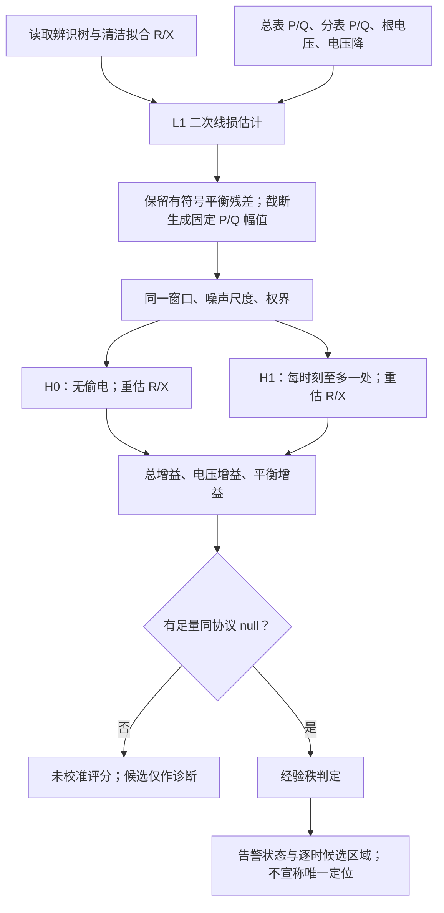

# 简化入口的执行逻辑

日期：2026-09-19。实现：`D:\0-github_workspace\Topo\theft_wzzt\detect_simple.py`。

## 一条主线



离线需要先拟合并冻结辨识树，再用相同流程生成无偷电校准分布。日常执行不拟合拓扑、不读真值线损、不扫描 L0–L4，不做额外固定 R/X 求解。

## 输入与单位

- 三个表格：`P_terminal`、`Q_terminal`、`drop_target`，行是时刻，列是观测终端编号。
- 三个序列：`root_voltage`、`P0_measured`、`Q0_measured`。
- `drop_target = V_root² − V_terminal²` 是观测电压派生量。
- 功率和电压均为 pu；边权是 2r_pu、2x_pu。
- 所有表格和序列时间索引必须一致；输入矩阵按辨识树的终端顺序重新对齐。
- 可选 `scenario_settings` 声明噪声与工况；没有声明时沿用原构造器默认值。这些默认值是建模假设，不是对真实测量精度的自动识别。

JSON 格式参见已生成的 `outputs/theft_simplification/measurements_exp2.json`：顶层包含 `index`、`terminals`、上述六个通道数组与 `scenario_settings`，不含真值通道。该示例来自既有 exp2 仿真，仅用于复现接口。

## 核心公式

1. 路径关联矩阵 z 给出量测分表聚合边流：Fₚ=Pzᵀ、F_q=Qzᵀ。
2. L1：l̂ₚ=Σₑ(wᵣ,e/2)(Fₚ,e²+F_q,e²)/V_root²；无功同理用 wₓ。
3. dₚ=P₀−ΣP−l̂ₚ，d_q=Q₀−ΣQ−l̂_q；固定输入 â=max(dₚ,0)、q̂=max(d_q,0)。评分保留有符号 dₚ。
4. 噪声尺度先由完整输入序列按原规则计算，再截取拟合窗口，以保持与 M7 一致。
5. H0/H1 共享观测、尺度和逐边权界；H1 允许全零选择，因此包含 H0。
6. G=J₀−J₁=G_voltage+G_balance，分别报告，不将两个分量视为独立证据。
7. 新入口仅用原 `calibrated_rank` 规则：p_rank=(1+#null_gain≥G)/(n+1)，p_rank≤α 才告警。比较的数值容差沿用原函数。

±25% 包络仍是 L1 周围的线损敏感性输出，不用于改变拟合或自动证明真实幅值覆盖。

## 三种不同状态

|状态|含义|告警/定位输出|
|---|---|---|
|`uncalibrated`|没有提供校准集|`alarm=null`；不发布定位结论|
|`insufficient_calibration`|有匹配协议的 null，但 1/(n+1)>α|同样没有判定能力；不是“没有偷电”|
|`calibrated`|声明协议匹配且秩分辨率足够|按经验秩返回布尔告警；不拒绝 H0 也不等于证明无偷电|

校准 JSON 必须含 `protocol_signature` 和 `null_gains`。签名对应 L1、树/权重、权界、数据长度、窗口、噪声与声明工况；它不证明数据来源、独立性、代表性或分布稳定。不要把旧 L0 校准值换签名后当成 L1 校准。

`candidate_locations_by_time` 始终只是该 MILP 最优解的选点；`reported_locations_by_time` 在没有有效告警时为 null。即使告警，也尚未计算位置剖面或唯一性证书。

## 执行方式

工作目录：`D:\0-github_workspace\Topo\theft_wzzt`。

```powershell
& 'D:\apps\miniconda3\envs\Topo\python.exe' detect_simple.py `
  outputs/theft_simplification/measurements_exp2.json `
  --window 44 52 `
  --output outputs/theft_simplification/example_new_result.json
```

当前示例没有匹配的足量校准集，因此正常结果是“未校准”，同时输出约 168.972 的 gain。输出路径已存在时拒绝覆盖。只有在另行准备了合格校准集之后，再增加 `--calibration 路径`。

Python 调用为：

```python
from detect_simple import detect, load_measurements, load_identified
result = detect(measurements, identified_tree, window=(44, 52), calibration=None)
```

## 对照与验证

- 原完整实验入口继续使用 `python -m experiments.run_theft ...`，M7 的 q95 历史口径不变。
- 简化入口没有改动 MILP、线损估计器或原实验文件；原 M7 签名仍有效。
- 三个代表场景的 gain、幅值和逐时选点与原 L1 完全一致；新入口的告警语义有意统一为经验秩，不能把“优化结果相同”写成“所有行为完全相同”。
- 回归脚本：`D:\0-github_workspace\Topo\scripts\check_theft_simple.py`。
- 校验记录：`D:\0-github_workspace\Topo\theft_wzzt\outputs\theft_simplification\validation.json`。
- 本轮只完成执行路径简化与证据评估。扩大校准、固定 R/X 消融、短窗单位置剖面和有界误差模型是后续建议，尚未实施。
