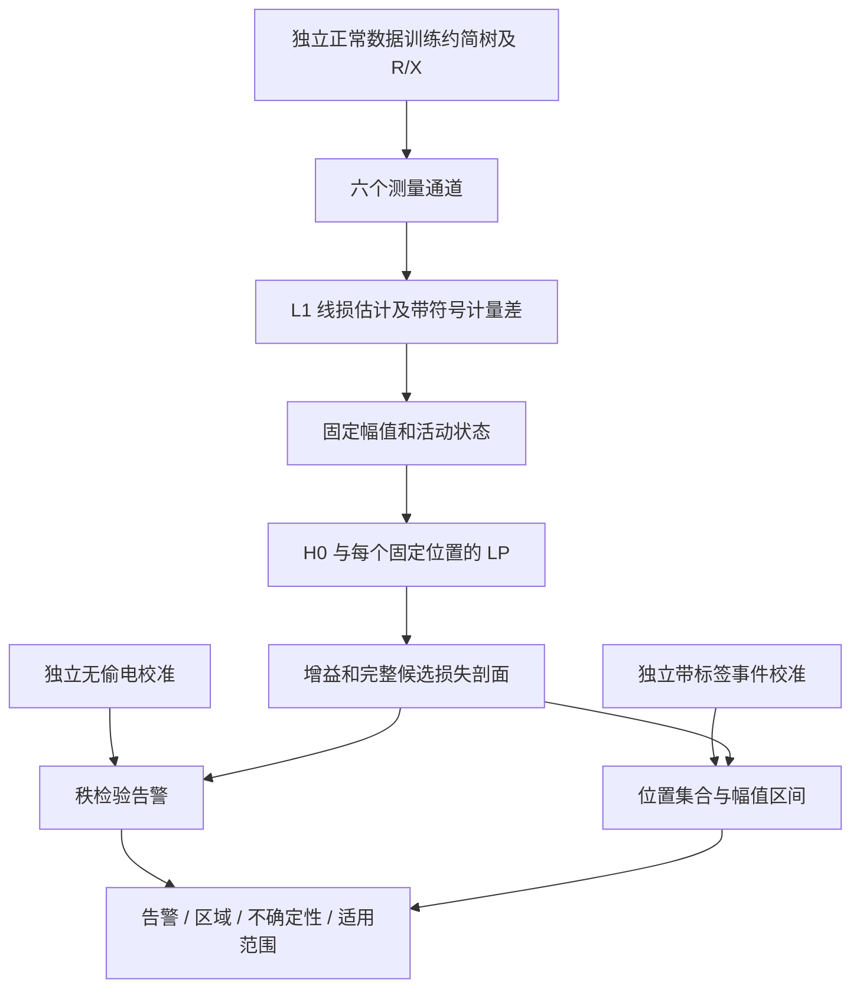

# 配电网未计量负荷研究：简化模型与执行逻辑

日期：2026-09-19。最终使用第11节的 `detect_conservative.py`；第9节提供其正则化模型，前两轮入口保留作对照。第1–8节描述第一轮 `detect_window.py` / `paper_study` 基线；其留出局限促成第9节的第二轮推荐路径。历史 M1–M7 文件与逐时 MILP 路径保留。统计结果见同目录 `theft_paper_readiness_20260919.md`。

## 1. 要回答的研究问题

终端与总表测量能够支持到什么程度的**未计量正负荷存在性、区域定位和幅值估计**？在 R/X 发生偏移、线损估计有偏、计量存在噪声时，结论怎样失效？“偷电”是物理异常的应用解释；相同位置、相同功率轨迹的合法未计量负荷与偷电，在当前传感器下不可区分。

本轮收窄目标：一个 32 点窗口内最多一个固定位置的正负荷，允许其间歇出现；输入为 96 点序列，检测窗口固定为 `[32,64)`。实验主要事件持续 6 点。位置移动及持续时间改变另列边界试验。尚未实现全天滑窗扫描的多重检验控制。

## 2. 输入、线损与幅值

推断仅使用六个测量通道：终端 P/Q、根节点电压、终端平方电压降、总表 P/Q。干净训练集经 RX75-RNJ + wzzᵀ L1-MILP 输出约简树和权重，作为后续模型的固定输入。真值网络与 `loss_*_true/notheft` 不进入推断。

在给定辨识树的边—终端关联矩阵 Z 上，用终端负荷形成支路潮流近似：

\[
\widehat\ell^P_t=\sum_e\frac{r_e^0}{2}\frac{(P_tZ^\top)_e^2+(Q_tZ^\top)_e^2}{(V^m_{0t})^2},
\]

无功线损同理使用 x。因模型预测平方电压降，r/x 已吸收因子 2，线损公式要除以 2。

\[
d_t=P^m_{0t}-\sum_i P^m_{it}-\widehat\ell^P_t,\qquad
\widehat a_t=(d_t)_+,\qquad
\widehat q_t=(Q^m_{0t}-\sum_iQ^m_{it}-\widehat\ell^Q_t)_+.
\]

d 保持符号；仅固定幅值取正部。它包含计量误差、线损估计误差和物理模型误差，不能当成真实偷电功率。本轮不做线损外迭代，不对幅值和 R/X 联合做非凸优化。

## 3. 从逐时 MILP 简化为有限个 LP

原模型每时刻可以选择不同位置和活动状态。新增模型作出两个明确限制：

- 窗口内位置 h 固定；
- 活动状态固定为 u_t=1[â_t>0]，不会从真值活动时段取值。

在每个候选 h 下，支路额外潮流已知，因此 A_h 只由测量和固定幅值构成：

\[
\mu_h(r,x)=[(PZ^\top+\widehat a c_h^\top)\odot r
 +(QZ^\top+(u\odot\widehat q)c_h^\top)\odot x]Z.
\]

P 项 â=0 时自然消失。Q 项也必须乘 u，避免在无有功幅值时产生来源不明的活动源。

\[
J_h=\min_{(r,x)\in\mathcal W}
\frac{\|Y-\mu_h(r,x)\|_1}{s_v}+
\frac{\|d-\widehat a\|_1}{s_b}.
\]

H0 用额外潮流为零的同一个 LP；同一窗口、同一尺度、同一参数边界：

\[
J_0=\min_{(r,x)\in\mathcal W}
\frac{\|Y-\mu_0(r,x)\|_1}{s_v}+\frac{\|d\|_1}{s_b},\qquad
J_1=\min\{J_0,\min_hJ_h\},\quad G=J_0-J_1\ge0.
\]

参数域沿用已有数据导出的界：每边下界 0.5 min(r⁰,x⁰)，上界 max(2 max(r⁰,x⁰),10⁻⁶)。并非两个参数分别限制在自身估计的 0.5–2 倍。

**等价性范围**：固定位置、固定 u 后，原 MILP 的二元变量和乘积变量都能消元；线性预测加绝对值上图就是 LP。枚举全部 H 个候选，再加入 H0，共 H+1 个 LP，精确求解这个受限模型的全局最小值。它不等价于原先允许逐时位置变化、自由活动的完整 MILP；原模型仍然保留。

每个 LP 检查 HiGHS 最优状态、直接重算的原始目标、约束残差与原始—对偶目标差。新增测试同时用原 MILP 固定二元变量验证每个候选 LP 的数值等价性。

## 4. 为什么要保留正常时段和位置集合

当窗口很短或 R/X 过于自由时，错误位置可能通过改变阻抗解释相同电压。仅返回最优位置，会把几乎并列的解包装成确定定位。较长窗口提供更多正常运行数据，限制 R/X 的这种补偿，但不保证所有样本唯一可辨识。

位置集合使用候选剖面损失：

\[
S(D,h)=J_h-\min_jJ_j,\qquad\Gamma(D)=\{h:S(D,h)\le\tau\}.
\]

集合包含约简树区域标签，不是隐藏物理母线编号的恢复证书。输出必须同时展示集合大小。若所有候选都相容，应报告无法进一步定位。

一个基本稳定性结果：若观测或幅值扰动使每个候选最优损失的变化不超过 ε，且第一、第二候选原始损失差大于 2ε，则最优候选不改变。证明直接由两次三角不等式得到。候选损失差很小时，不能因优化器返回唯一一行就宣称物理位置可辨识。

## 5. 总表与电压证据不能重复计算

固定活动后，所有 H1 候选的平衡损失完全相同：

\[
B_0-B_1=\sum_t(d_t)_+/s_b.
\]

因此位置的区分全部来自电压通道；总表提供幅值及存在性证据。G 中的平衡增益与 â 同源，不能称为独立交叉验证。本轮保留“只看总表正残差”基线和电压增益统计量，检验复杂模型究竟增加了什么。

联合 R/X 重估也不是对所有误差自动鲁棒。它主要改变电压拟合；线损失配仍可改变平衡增益和零分布，必须单独检验校准迁移。

## 6. 三种校准各自保证什么

**告警**：用独立无偷电数据执行完全相同推断，获得 G₁,…,Gₙ；p=(1+#{Gᵢ≥G})/(n+1)，p≤0.05 告警，使用已有实现的 10⁻⁷ 保守比较容差。训练与方法配置固定、校准和新样本可交换时，这个秩检验的边际误报概率不超过 5%。它不是某次偷电为真的后验概率，也不保证固定一次校准集后任意新分布上的误报率。

**位置集合**：另用 199 个独立带标签模拟事件校准 S(D,h真)，τ 为第 190 个顺序统计量。随机事件按网络内非根节点均匀选点、幅值从 2/4/8 kW 均匀选取、起始点从 36…54 均匀选取。留出随机测试采用同一生成规则。因此 95% 是对这套事件混合分布的边际覆盖目标；不能自动解释为每个节点、每种幅值或“已告警样本中的”95%覆盖。

**幅值区间**：同一独立事件校准集上取 E=max_t|â_t−a_t真|，ρ 为第 190 个顺序统计量，输出 [max(â−ρ,0),â+ρ]。目标是整个 32 点窗口同时覆盖；包括计量与模型误差，区别于 M7 只假设线损 ±25% 的包络。位置与幅值分别校准到 95%，并不构成二者联合 95%保证。

带标签模拟校准不是现场可信标签的替代品。当前没有真实电网覆盖保证。上述秩与集合推理依赖可交换性，相关理论可参见 [Kuchibhotla, Exchangeability, Conformal Prediction, and Rank Tests, v3](https://arxiv.org/abs/2005.06095v3)。

## 7. 执行逻辑



训练复现：`python -m paper_study.train_cases`。开发试验：`python -m paper_study.pilot`、`python -m paper_study.development`、`python -m paper_study.dev_stress`。正式冻结实验：`python -m paper_study.run_study`；已存在逐样本 JSON 则跳过。若冻结源码或作业列表改变，拒绝续跑，避免混合不同协议。失败 JSON 保留，不能当成成功样本跳过后继续宣称全完成。

所有命令均须在 `D:\0-github_workspace\Topo\theft_wzzt` 下，用 `D:\apps\miniconda3\envs\Topo\python.exe`，不使用 PATH 中其他 Python。

测量入口示例（输出需使用尚不存在的路径）：

```powershell
& 'D:\apps\miniconda3\envs\Topo\python.exe' detect_window.py `
  outputs/theft_simplification/measurements_exp2.json `
  --calibration outputs/theft_paper/calibration_paper15.json `
  --output outputs/theft_paper/window_example_new.json
```

无校准时输出 `alarm=null`；校准的树、噪声配置或推断源码哈希不匹配则拒绝。该检查能发现声明配置变化，不能自动发现未知分布漂移。

## 8. 论文应如何定位

已有研究用智能电表电压灵敏度估计实际用电并检测绕表，还在 IEEE European LV 与随机网络上评估，不能把“电压发现偷电”本身作为创新。[Pengwah et al., IEEE TPWRD 2023，作者机构论文摘要](https://research.monash.edu/en/publications/model-less-non-technical-loss-detection-using-smart-meter-data/)

本项目较合理的主线是：**约简拓扑上的未计量正负荷区域辨识，结合阻抗重估、精确受限优化与可检验的不确定性输出**。有限枚举、L1 LP、秩校准各自都是已有工具；贡献需要落在它们对本问题的组织、辨识边界及与更简单方法的可复现比较。本轮另核对了 Carmona-Pardo 等 PSCC 2026 会议原文，见第10节；未完成其数值复现或穷尽查新。


## 9. 第二轮：对逐边 R/X 加入收缩约束

第一轮自由逐边重估在 paper15 随机留出事件中仅达到 70/100 点定位正确、88/100 区域集合覆盖。该失败完整保留，不能通过更改同一测试集上的阈值消失。第二轮使用全新的开发、校准和测试种子。

先尝试仅估计一个或两个全局阻抗倍率；它们能适应统一漂移，但不能充分适应各边独立变化。推荐版本采用可退化的折中：保留 w=(r,x)，增加公共倍率 ρ，以及先验代价

\[
\Omega(w,\rho)=\lambda\sum_{i=1}^{2E}
\frac{|w_i-\rho w_i^0|}{s_i},\qquad
s_i=\max(r_e^0,x_e^0,10^{-6}),\quad 0.5\le\rho\le2.
\]

每个位置的优化目标变为 J_h^reg=数据损失+Ω；H0 完全使用相同 Ω 和参数域。给每个绝对值引入一个非负上图变量，仍为 LP。λ=0 回到第一轮自由重估；大 λ 倾向于共同漂移，有限 λ 允许局部偏差。

新开发集使用 replicate 7000–7004，正常、统一 +10% 漂移、各边独立 ±10% 漂移三个条件，两个位置、三个幅值，共90组。固定比较 λ=3/10/30，正确点定位分别74/90、78/90、75/90，因此冻结 λ=10。该选择在第二轮校准及测试运行前写入 `outputs/theft_paper_v2/frozen_protocol.json`，没有依据第二轮测试修改参数。

新增增益分解：

\[
G=G_V+G_B+G_\Omega.
\]

先验增益不得混入“纯观测解释提升”。告警校准使用完整正则化推断流程；剖面损失也包括同样先验。该方法的最优性仅针对这一声明的受限、正则化模型。

为减少一次较小校准集碰巧给出过窄集合的风险，第二轮的位置和幅值各自使用**非参数单侧容忍限**。给定 n=199 个独立校准分数，选最小的 k 使

\[
\Pr\{\mathrm{Binomial}(n,0.95)\le k-1\}\ge0.95.
\]

得到 k=195，而第一轮普通分裂校准使用 k=190。位置阈值和幅值半径分别取各自分数的第195顺序统计量。在匹配的独立同分布条件下，每一个阈值分别以至少95%的校准置信程度，覆盖对应事件分布至少95%的概率质量。离散分数/并列值只会使此上界更保守。它仍不保证每个节点、每种幅值、已告警子群或位置与幅值联合覆盖。非参数容忍限的总体覆盖率与置信程度区别见 [NIST 说明](https://www.itl.nist.gov/div898/software/dataplot/refman1/auxillar/tolelimi.htm)。

告警规则仍为原有保守经验秩 ≤0.05；容忍限改动只作用于位置集合与幅值区间。

推荐执行命令：

```powershell
# 新增独立研究矩阵；三进程分别处理互不重叠的数据文件
& 'D:\apps\miniconda3\envs\Topo\python.exe' -m paper_study_v2.run_study --workers 3

# 使用六个测量通道的推荐入口
& 'D:\apps\miniconda3\envs\Topo\python.exe' detect_regularized.py `
  outputs/theft_simplification/measurements_exp2.json `
  --calibration outputs/theft_paper_v2/calibration_paper15.json `
  --output outputs/theft_paper_v2/example_new.json
```

首轮 `detect_window.py` 留作无先验消融；`detect_simple.py` 与原逐时 MILP 均保留。各路径的校准文件不能互换。

## 10. 最近邻文献核对及差异

[Carmona-Pardo 等，PSCC 2026 官方会议页](https://pscc.epfl.ch/modules/request.php?action=summary.php&id=34&module=oc_program)提供原始会议论文。其正文 III 节假定拓扑、导线类型和表计相别已知；IV 节式(1)用固定灵敏度、功率调整变量及线路二元变量构造凸混合整数二次优化；V 节在改编的53母线、208节点低压网络上模拟四类可见/不可见偷电。已读相应正文并渲染核对模型页。

这意味着“优化+电压和总表+不可见偷电+全局最优”不足以单独成为新颖性主张。当前可能保留的差异是从数据辨识约简树、显式处理 R/X 偏差与定位混淆、以及经独立数据检验的区域集合和幅值区间。三相四线、线路中点偷电及现场网络真实性方面，对方证据更强。本轮没有复现该方法，不能宣称性能优于它。

期刊页面列2027年卷期，但会议原文已标注2026年6月8–12日 PSCC。因此本报告按已可核对的2026会议版本进行比较，不把未来卷期当作尚未出现的工作。


## 11. 第三轮：模型固定，使用最大校准分数

第二轮不能当成完成品：flynn16 的区域覆盖为90/100，paper15 线损低估条件下复合告警仍误报11/100。三个网络上，正则化与自由重估的配对点定位差异均不显著。因此不再搜索模型结构或更改 λ，而是将校准尾部保守性单独作为第三轮研究对象。

第三轮仍使用 λ=10 和同样测量/候选/参数域，但采用完全新的种子：无偷电校准20000–20198（压力条件20200–20398）、无偷电测试21000–21099、带标签事件校准22000–22198、随机事件测试23000–23099、网格事件测试24000–24019。所有零分布库均为199条，所有位置/幅值校准也为199条。

对任何一个已声明的零假设分布 j，令 q_j=max_i Gᵢʲ。最终告警当且仅当

\[
G>\max_j q_j+10^{-7}.
\]

运行时不需要知道真实漂移条件。在该库包含真实零假设、校准及测试可交换时，对分布 j 的边际误报概率不超过1/200=0.5%。同样，对位置剖面分数和窗口最大幅值误差各自取199条校准数据的最大值，对匹配事件分布各自具有至少99.5%的边际覆盖。

在更强的独立同分布条件下，还可得到单侧容忍限性质：每一个最大分数界，以概率至少1−0.95^199≈99.9963%，覆盖其分布至少95%的概率质量。这些概率仍然不是某一案件的真实偷电概率，亦不是每个节点的覆盖保证。位置、幅值、多个零分布库一起成立时需另作同时性控制，不能把单项置信度直接当成联合置信度。

paper15 的库包括正常、统一+10%阻抗、逐边±10%阻抗、L1线损估计下调25%四个分数生成机制；其他两个网络只验证正常分布。线损下调是对估计器的压力扰动，不能被扩展解释为覆盖所有现场技术线损错误。这个有限库不构成连续不确定区间上的鲁棒优化保证。

代价必须一并报告：更大的阈值可能漏掉弱事件，位置集合和幅值区间可能增宽。第三轮使用新测试数据检验这些代价，不把前两轮失败样本重标为成功。

最终入口为 `detect_conservative.py`；前两轮入口保留供追溯。校准文件检查测量协议、具体入口文件、推断源码以及顺序统计量，禁止不同版本互换。

```powershell
& 'D:\apps\miniconda3\envs\Topo\python.exe' -m paper_study_v3.run_study --workers 3
& 'D:\apps\miniconda3\envs\Topo\python.exe' detect_conservative.py `
  outputs/theft_simplification/measurements_exp2.json `
  --calibration outputs/theft_paper_v3/calibration_paper15.json `
  --output outputs/theft_paper_v3/example_new.json
```

## 12. 数值证书的准确措辞

LP 与固定二元变量的原 MILP 在数学上等价。在6个真实开发场景/窗口对照中，最优全局增益差不超过2.1×10⁻¹²；但部分非最优候选剖面的直接目标差可达3.1×10⁻⁴，原 MILP 相应原始约束残差约10⁻⁷。不能把“数学等价”写成所有浮点候选目标逐位相同。紧凑 LP 的原始—对偶、直接目标和约束残差另行逐次检查；所有容差及最大实测误差保存在结果 JSON。
